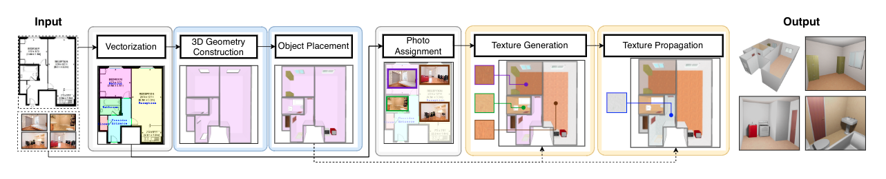

# Plan2Scene

Official repository of the paper:

__Plan2Scene: Converting floorplans to 3D scenes__

[Madhawa Vidanapathirana](https://github.com/madhawav), [Qirui Wu](), [Yasutaka Furukawa](), [Angel X. Chang](https://github.com/angelxuanchang)
, [Manolis Savva](https://github.com/msavva)

[[Paper](https://arxiv.org/abs/2106.05375), [Project Page](https://3dlg-hcvc.github.io/plan2scene/), [Google Colab Demo](https://colab.research.google.com/drive/1lDkbfIV0drR1o9D0WYzoWeRskB91nXHq?usp=sharing)]


In the Plan2Scene task, we produce a textured 3D mesh of a residence from a floorplan and set of photos.

## Dependencies
1) We use a conda environment initialized as [described here](./docs/md/conda_env_setup.md).
2) Setup the `command line library` of [Embark Studios texture-synthesis](https://github.com/EmbarkStudios/texture-synthesis#command-line-binary) project. 
    1) You can download a pre-built binary [available here](https://github.com/EmbarkStudios/texture-synthesis/releases). Alternatively, you may build from the source.
    2) Download the seam mask [available here](https://github.com/EmbarkStudios/texture-synthesis/blob/main/imgs/masks/1_tile.jpg).   
    3) Rename `./conf/plan2scene/seam_correct-example.json` to 'seam_correct.json' and update the paths to the texture synthesis command line library binary, and the seam mask.

Use 'code/src' as the source root when running python scripts.
```bash
export PYTHONPATH=./code/src
```

## Data
1) Rent3D++ dataset
    1. Download and copy the [Rent3D++ dataset](https://forms.gle/mKAmnrzAm3LCK9ua6) to the `[PROJECT_ROOT]/data` directory. The data organization is [described here](docs/md/rent3dpp_data_organization.md).
    2. [Optional] We have provided 3D scenes pre-populated with CAD models of objects. 
       If you wish to re-populate these scenes using the _Object Placement_ approach we use, [follow the instructions here](docs/md/place_cad_models.md).    
    3. To replicate our results, you should use the pre-extracted crops we provide. 
       These crops are provided with the Rent3D++ dataset and are copied to the `./data/processed/surface_crops` directory.
       
       [Optional] If you wish to extract new crops instead of using these provided crops, following [these instructions](./docs/md/extract_crops.md).
    4. Select ground truth reference crops and populate photo room assignment lists.
       ```bash
       # Select ground truth reference crops.
       python code/scripts/plan2scene/preprocessing/generate_reference_crops.py ./data/processed/gt_reference/train ./data/input/photo_assignments/train train
       python code/scripts/plan2scene/preprocessing/generate_reference_crops.py ./data/processed/gt_reference/val ./data/input/photo_assignments/val val
       python code/scripts/plan2scene/preprocessing/generate_reference_crops.py ./data/processed/gt_reference/test ./data/input/photo_assignments/test test 
       
       # We evaluate Plan2Scene by simulating photo un-observations.
       # Generate photoroom.csv files considering different photo un-observation ratios.
       python code/scripts/plan2scene/preprocessing/generate_unobserved_photo_assignments.py ./data/processed/photo_assignments/train ./data/input/photo_assignments/train ./data/input/unobserved_photos.json train
       python code/scripts/plan2scene/preprocessing/generate_unobserved_photo_assignments.py ./data/processed/photo_assignments/val ./data/input/photo_assignments/val ./data/input/unobserved_photos.json val
       python code/scripts/plan2scene/preprocessing/generate_unobserved_photo_assignments.py ./data/processed/photo_assignments/test ./data/input/photo_assignments/test ./data/input/unobserved_photos.json test  
       ```
2) [Optional] Stationary Textures Dataset - We use one of the following datasets to train the texture synthesis model. 
   _Not required if you are using pre-trained models._
    - __Version 1__: We use this dataset in our CVPR paper. Details are available [here](./docs/md/stationary_textures_dataset_v1.md).
    - __Version 2__: Updated textures dataset which provides improved results on the Rent3D++ dataset. Details are available [here](./docs/md/stationary_textures_dataset_v2.md).
   
3) [Optional] [Substance Mapped Textures dataset](./docs/md/smt_dataset.md). _Only used by the retrieve baseline._

## Pretrained models
Pretrained models are available [here](./docs/md/pretrained_models.md).

## Inference on Rent3D++ dataset
1) Download and pre-process the Rent3D++ dataset as described in the data section.
2) Setup a [pretrained model](./docs/md/pretrained_models.md) or train a new Plan2Scene network.    
2) Synthesize textures for observed surfaces using the VGG textureness score.
   ```bash
   # For test data without simulating photo unobservations. (drop = 0.0)
   python code/scripts/plan2scene/preprocessing/fill_room_embeddings.py ./data/processed/texture_gen/test/drop_0.0 test --drop 0.0
   python code/scripts/plan2scene/crop_select/vgg_crop_selector.py ./data/processed/vgg_crop_select/test/drop_0.0 ./data/processed/texture_gen/test/drop_0.0 test --drop 0.0
   # Results are stored at ./data/processed/vgg_crop_select/test/drop_0.0
   ```

4) Propagate textures to unobserved surfaces using our texture propagation network.
   ```bash
   python code/scripts/plan2scene/texture_prop/gnn_texture_prop.py ./data/processed/gnn_prop/test/drop_0.0 ./data/processed/vgg_crop_select/test/drop_0.0 test GNN_PROP_CONF_PATH GNN_PROP_CHECKPOINT_PATH --keep-existing-predictions --drop 0.0
   ```
   To preview results, follow the instructions below.

## Previewing outputs
1) Complete inference steps.
2) Correct seams of predicted textures and make them tileable.
   ```bash
   # For test data without simulating photo unobservations.
   python code/scripts/plan2scene/postprocessing/seam_correct_textures.py ./data/processed/gnn_prop/test/drop_0.0/tileable_texture_crops ./data/processed/gnn_prop/test/drop_0.0/texture_crops test --drop 0.0
   ```
3) Generate .scene.json files with embedded textures using [embed_textures.py](code/scripts/plan2scene/postprocessing/embed_textures.py).
   A scene.json file describes the 3D geometry of a house. 
   It can be previewed via a browser using the 'scene-viewer' of [SmartScenesToolkit](https://github.com/smartscenes/sstk) (You will have to clone and build the SmartScenesToolkit).
   ```bash
   # For test data without simulating photo unobservations.
   python code/scripts/plan2scene/postprocessing/embed_textures.py ./data/processed/gnn_prop/test/drop_0.0/archs ./data/processed/gnn_prop/test/drop_0.0/tileable_texture_crops test --drop 0.0
   # scene.json files are created in the ./data/processed/gnn_prop/test/drop_0.0/archs directory.
   ```
4) Render .scene.json files as .pngs using [render_house_jsons.py](code/scripts/plan2scene/render_house_jsons.py).
    - Download and build the [SmartScenesToolkit](https://github.com/smartscenes/sstk).
    - Rename `./conf/render-example.json` to `./conf/render.json` and update its fields to point to scene-toolkit.
    - Run the following command to generate previews.
       ```bash
       CUDA_VISIBLE_DEVICES=0 python code/scripts/plan2scene/render_house_jsons.py ./data/processed/gnn_prop/test/drop_0.0/archs --scene-json
       # A .png file is created for each .scene.json file in the ./data/processed/gnn_prop/test/drop_0.0/archs directory.
       ```
5) Generate qualitative result pages with previews using [preview_houses.py](code/scripts/plan2scene/preview_houses.py).
   ```bash
   python code/scripts/plan2scene/preview_houses.py ./data/processed/gnn_prop/test/drop_0.0/previews ./data/processed/gnn_prop/test/drop_0.0/archs ./data/input/photos test --textures-path ./data/processed/gnn_prop/test/drop_0.0/tileable_texture_crops 0.0
   # Open ./data/processed/gnn_prop/test/drop_0.0/previews/preview.html
   ```
## Test on Rent3D++ dataset
1) [Optional] Download a pre-trained model or train the substance classifier used by the Subs metric. 
   Training instructions are available [here](./docs/md/train_substance_classifier.md).
   Pre-trained weights are available [here](./docs/md/pretrained_models.md).
   Skip this step to omit the Subs metric.
2) Generate overall evaluation report at 60% photo unobservations. We used this setting in paper evaluations.
   ```bash
   # Synthesize textures for observed surfaces using the VGG textureness score.
   # For the case: 60% (i.e. 0.6) of the photos unobserved. 
   python code/scripts/plan2scene/preprocessing/fill_room_embeddings.py ./data/processed/texture_gen/test/drop_0.6 test --drop 0.6
   python code/scripts/plan2scene/crop_select/vgg_crop_selector.py ./data/processed/vgg_crop_select/test/drop_0.6 ./data/processed/texture_gen/test/drop_0.6 test --drop 0.6
   
   # Propagate textures to un-observed surfaces using our GNN.
   # For the case: 60% (i.e. 0.6) of the photos unobserved.
   python code/scripts/plan2scene/texture_prop/gnn_texture_prop.py ./data/processed/gnn_prop/test/drop_0.6 ./data/processed/vgg_crop_select/test/drop_0.6 test GNN_PROP_CONF_PATH GNN_PROP_CHECKPOINT_PATH --keep-existing-predictions --drop 0.6
   
   # Correct seams of texture crops and make them tileable.
   # For test data where 60% of photos are unobserved.
   python code/scripts/plan2scene/postprocessing/seam_correct_textures.py ./data/processed/gnn_prop/test/drop_0.6/tileable_texture_crops ./data/processed/gnn_prop/test/drop_0.6/texture_crops test --drop 0.6
   
   # Generate overall results at 60% simulated photo unobservations.
   python code/scripts/plan2scene/test.py ./data/processed/gnn_prop/test/drop_0.6/tileable_texture_crops ./data/processed/gt_reference/test/texture_crops test
   ```
3) Generate evaluation report for observed surfaces. No simulated unobservation of photos. We used this setting in paper evaluations.
   ```bash
   # Run inference on using drop=0.0.
   python code/scripts/plan2scene/preprocessing/fill_room_embeddings.py ./data/processed/texture_gen/test/drop_0.0 test --drop 0.0
   python code/scripts/plan2scene/crop_select/vgg_crop_selector.py ./data/processed/vgg_crop_select/test/drop_0.0 ./data/processed/texture_gen/test/drop_0.0 test --drop 0.0
   
   # Correct seams of texture crops and make them tileable by running seam_correct_textures.py.
   python code/scripts/plan2scene/postprocessing/seam_correct_textures.py ./data/processed/vgg_crop_select/test/drop_0.0/tileable_texture_crops ./data/processed/vgg_crop_select/test/drop_0.0/texture_crops test --drop 0.0
   
   # Generate evaluation results for observed surfaces.
   python code/scripts/plan2scene/test.py ./data/processed/vgg_crop_select/test/drop_0.0/tileable_texture_crops ./data/processed/gt_reference/test/texture_crops test
   ```
5) Generate evaluation report for unobserved surfaces at 60% photo unobservations. We used this setting in the paper evaluations.
   ```bash   
   # It is assumed that the user has already generated the overall report at 0.6 drop fraction.
   
   # Generate results on unobserved surfaces at 60% simulated photo unobservations.
   python code/scripts/plan2scene/test.py ./data/processed/gnn_prop/test/drop_0.6/tileable_texture_crops ./data/processed/gt_reference/test/texture_crops test --exclude-prior-predictions ./data/processed/vgg_crop_select/test/drop_0.6/texture_crops
   ```

 6) Generate evaluation report on FID metric as described [here](./docs/md/compute_fid_metric.md).

## Inference on custom data
If you have scanned images of floorplans, you can use [raster-to-vector](https://github.com/art-programmer/FloorplanTransformation) to convert those floorplan images to a vector format. Then, follow the [instructions here](./docs/md/plan2scene_on_r2v.md) to create textured 3D meshes of houses. 

If you have floorplan vectors in another format, you can convert them to the raster-to-vector __annotation format__. 
Then, follow the same instructions as before to create textured 3D meshes of houses. 
The R2V annotation format is explained with examples in the [data section of the raster-to-vector repository](https://github.com/art-programmer/FloorplanTransformation#data).

## Training a new Plan2Scene network
Plan2Scene consists of two trainable components, 1) the texture synthesis stage and 2) the texture propagation stage. Each stage is trained separately. The training procedure is as follows.
1) Train the texture synthesis stage as described [here](./docs/md/train_texture_synth.md).
2) Train the texture propagation stage as described [here](./docs/md/train_texture_prop.md).

## Baseline Models
The baseline models are [available here](./docs/md/baselines.md).
