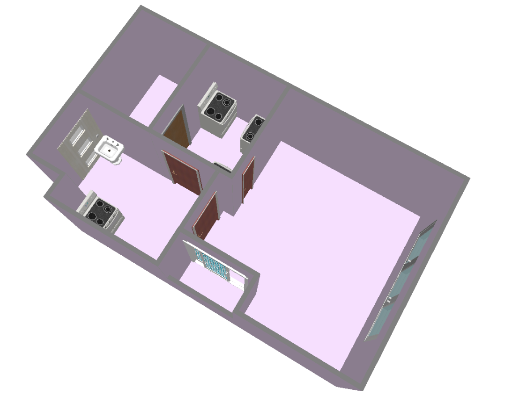

## Using Plan2Scene with Raster-to-Vector output
If you have a scanned image of a floorplan, you can use [raster-to-vector](https://github.com/art-programmer/FloorplanTransformation) to convert it to a vector format. Then, follow the steps below to create textured 3D mesh of the house.

If you have a floorplan vector in another format, you can convert it to the raster-to-vector __annotation format__. 
Then, follow the same steps below to create a textured 3D mesh of a house.
The R2V annotation format is explained with examples in the [data section of the raster-to-vector repository](https://github.com/art-programmer/FloorplanTransformation#data).

1) Convert the R2V output / R2V annotation to the scene.json format using the [R2V-to-Plan2Scene tool](https://github.com/3dlg-hcvc/r2v-to-plan2scene).

2) [Optional] To place CAD models for doors, windows and fixed objects, use the scripts [place_hole_cad_models.py](https://github.com/3dlg-hcvc/plan2scene/blob/main/code/scripts/plan2scene/place_hole_cad_models.py) and [place_object_cad_models.py](https://github.com/3dlg-hcvc/plan2scene/blob/main/code/scripts/plan2scene/place_object_cad_models.py).
    ```bash
    # Example
    cd [Plan2Scene Path]
    python code/scripts/plan2scene/place_hole_cad_models.py ../custom_data/hole_filled [R2V-to-Plan2Scene Output Directory]
    python code/scripts/plan2scene/place_object_cad_models.py ./custom_data/object_added ./custom_data/hole_filled [R2V-to-Plan2Scene Output Directory]
    ```
    You can preview the './custom_data/object_added/*.scene.json' file using [SmartScenesToolkit](https://github.com/smartscenes/sstk).

    

3) To generate textures for architectural surfaces using Plan2Scene, you should do a few more steps.
    - Update the `rooms` section of the scene.json file so the room type labels are compatible with the labels used by Plan2Scene networks. Plan2Scene pre-trained networks we provide uses [these room type labels](../../conf/plan2scene/labels/room_types.json).
    - Obtain rectified crops from the photos of the house. Refer to [instructions here](./extract_crops.md).
    - Write a photoroom.csv file indicating assignment of photos to rooms. The format of photoroom.csv file is [described here](./rent3dpp_data_organization.md#photo_assignments). Please refer to Rent3D++ dataset for example files.
4) Now, you can use Plan2Scene texture generation and texture propagation stages to apply textures to all architectural surfaces of the scene.json file.
   You can either use our colab notebook, or clone the project locally.
      - __Predicting textures using Google Colab__
         - Use [this colab notebook](https://colab.research.google.com/drive/1lDkbfIV0drR1o9D0WYzoWeRskB91nXHq?usp=sharing) we provide to obtain a textured *.scene.json file using Plan2Scene. Upload the *.scene.json file, *.photoroom.csv file and rectified surface crops when prompted.
      - __Predicting textures using a local copy of the code__
         - Clone the [Plan2Scene code repository](https://github.com/3dlg-hcvc/plan2scene) and install dependencies. 
         - Setup a pre-trained model for 'Texture Synthesis' and 'Texture Propagation' as [described here](pretrained_models.md).
         - Use [predict_textures.py](../../code/scripts/plan2scene/predict_textures.py) to predict textures
            ```bash
           python code/scripts/predict_textures.py [OUTPUT_DIRECTORY_PATH] [SCENE_JSON_PATH] [PHOTOROOM_CSV_PATH] [RECTIFIED_CROPS_PATH] [GNN_PROP_CONF_PATH] [GNN_PROP_CHECKPOINT_PATH]
           ```
             - RECTIFIED_CROPS_PATH: A directory containing 3 sub-directories 'floor', 'wall' and 'ceiling' each containing rectified crops extracted from the photos.
         - The final textured scene.json file is stored at '[OUTPUT_DIRECTORY_PATH]/textured_arch' directory.
5) The textured scene.json file can be previewed using the [SmartScenesToolkit](https://github.com/smartscenes/sstk). 